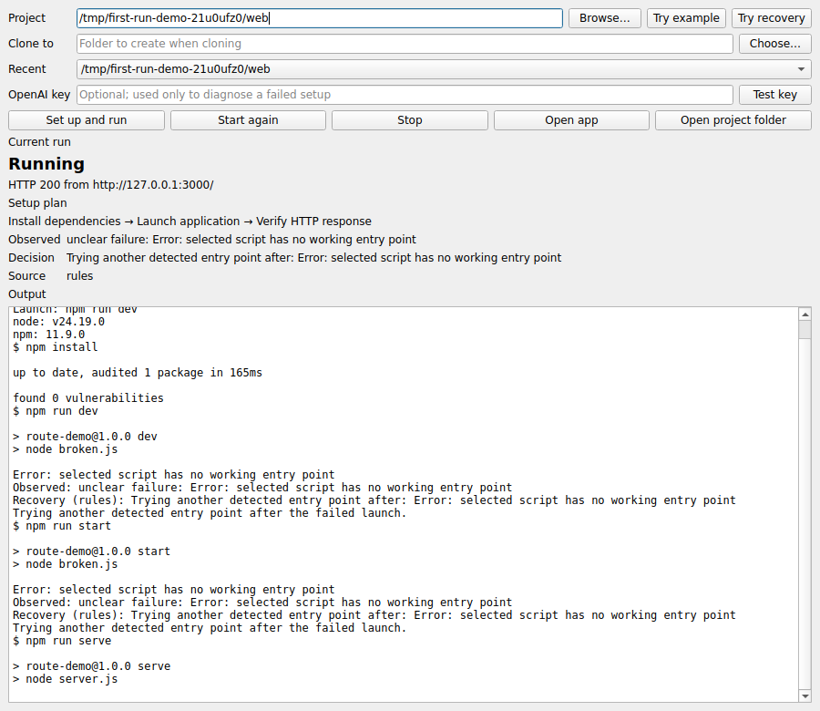

# First Run

First Run is a desktop utility for getting an unfamiliar web project running locally. Choose a folder or public HTTPS Git repository; it detects a conventional Python or npm setup, installs dependencies, starts the app, and verifies an HTTP response before showing **Running**.

When launch fails, First Run can try a known alternative route, ask for missing input, or explain why it stopped. An optional OpenAI decision can request a bounded inspection and use its result to choose the next allowed step. Project commands, process control, and HTTP verification remain in Python.



The screenshot shows a local three-script project recovering with rules, without an API key.

## Try it

Python 3.11 or newer is required. Install Git for repository URLs and the appropriate Python or Node runtime for the project you want to run.

**Windows:** [Download the ZIP](https://github.com/SahilBh01r1769/Build_New/archive/refs/heads/main.zip), extract it where you want it, and double-click `run-windows.cmd`. The first launch installs the desktop dependency into `.venv` beside the launcher; later launches reuse it. The Windows `py` launcher must be available. Click **Try example** and **Set up and run** for a small Flask project that needs no Node installation.

**macOS/Linux:**

```bash
python -m venv .venv
source .venv/bin/activate
python -m pip install -e .
first-run
```

Enter a local folder or HTTPS Git URL. A URL needs a new destination folder. Use **Open app** after verification, **Stop** to end the launched process, and **Start again** to reuse a successful setup and saved route. A single nested component can be found automatically; select a component yourself when a repository has several. **Needs input** names an empty environment value or unavailable service; address it and click **Continue setup**.

**Try recovery** selects a bundled Flask project whose `app.py` is a plausible but wrong guess while `main.py` contains the app. The first setup attempts the failed route and then a detected alternative. For an AI run, enter a key in the masked OpenAI field and use **Test key** before **Set up and run**. The field is not saved. **Start again** uses the saved good route, so it is a rerun check rather than a fresh recovery trial.

First Run creates a Python `.venv` in the selected project, or uses npm for a Node project. Install and launch scripts in a selected repository are code that will execute on your machine. It supports common FastAPI, Flask, Django, and Streamlit root entries and npm `dev`, `start`, or `serve` scripts.

## How recovery works

The runner gathers detected routes and a concise failure observation. A model decision is limited to available actions: inspect more captured output, inspect conventional Python entry files for a static `app` hint, retry a detected untried route, retry a transient install once, ask for user input, or stop as blocked. The runner returns inspection results as new observations, validates the next decision, and verifies a launched process over HTTP. The recovery steps and their **AI**, **rules**, or **fallback** source appear in the desktop beside the raw output.

Inspections are repeat limited, launch routes are tried once, and the decision and launch budgets are bounded. The model cannot provide a command, install an arbitrary package, change source code, or alter an external service. Without a key, rules still handle known safe recoveries. A provider error falls back to rules. The provider key is excluded from project processes; obvious credentials in failure evidence are redacted before a model request. Review project logs before enabling AI, since redaction cannot recognize every secret.

## Checked behavior

| Case | Observed result |
| --- | --- |
| [Mythos](https://github.com/SahilBh01r1769/indo_european_gods), npm web project | HTTP 200 on port 4173; Stop and Start again worked without reinstalling on Linux. |
| [MDN Django Local Library](https://github.com/mdn/django-locallibrary-tutorial) | On a fresh checkout, missing local SQLite tables led to a controlled migration and then HTTP 200 on Linux. |
| Bundled Flask project with port 5000 occupied | Started on port 5001 and verified HTTP 200 on Linux. |
| Bundled Flask recovery fixture | Rules recovered to `main.py` on Linux. A real OpenAI response selected that route on Windows and HTTP 200 was verified. The newer inspect-then-decide path is covered by mocked API tests, not a live multi-step model run. |
| [MDN Express Local Library](https://github.com/mdn/express-locallibrary-tutorial) | Reported **Needs input** when MongoDB was unreachable; the external database was not supplied. |
| [FastAPI example](https://github.com/vahidrezazadeh/fastapi-example) | Stopped at an application `NameError` without editing source. |

## Scope

- Designed for conventional Python and npm web projects, not arbitrary repositories or multi-service orchestration.
- System runtimes, credentials, and external services remain the user's responsibility. Source bugs are diagnosed, not rewritten.
- HTTP verification checks common local routes. Apps with unusual startup or authentication requirements may need manual inspection.

Run `python -m unittest discover -s tests -v` for the test suite. GitHub Actions runs it with Python 3.11, Node 20, and Qt offscreen. Automated model behavior uses mocked responses; the Windows fixture above established one live API decision, while live multi-step investigation remains to be checked.
