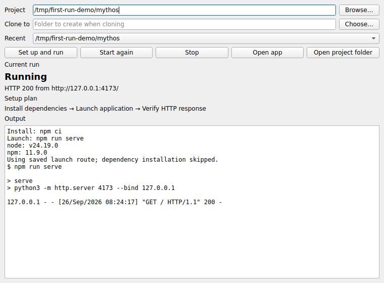

# First Run

First Run is a desktop tool for getting an unfamiliar Python or Node web project running locally. Give it a local folder or a public HTTPS Git URL. It inspects a few common manifests, prepares a project-local setup, starts the app, and checks for an HTTP response before reporting **Running**.

It is aimed at ordinary small web projects, not arbitrary repositories. **Blocked** and **Needs input** are useful outcomes when the tool cannot safely finish a setup.



## Use it

Python 3.11 or newer, Git (for URLs), and the relevant Python or Node runtime must already be installed.

**Windows:** [Download the ZIP](https://github.com/SahilBh01r1769/Build_New/archive/refs/heads/main.zip), extract it where you want the project to live, and double-click `run-windows.cmd`. The first launch creates `.venv` beside the launcher and installs the desktop dependency; later launches reuse it. The Windows `py` launcher must be available. Click **Try example** then **Set up and run** for a small Flask app that needs no Node installation. After it reports **Running**, try **Open app**, **Stop**, and **Start again**.

The launcher and its environment stay in the folder you extracted. Python and pip may still use their normal system temporary and cache folders during installation.

**macOS/Linux or manual installation:**

```bash
python -m venv .venv
source .venv/bin/activate
python -m pip install -e .
first-run
```

Enter a folder or an HTTPS Git URL. For a URL, choose a new destination folder. Click **Set up and run**. The plan, observations, commands, and process output appear in the window. When an environment value is missing, open the project folder, fill the named value in `.env`, and click **Continue setup**. An unreachable MongoDB connection also produces **Needs input**: check the project's database URL and service, then continue. A completed dependency installation is reused on continuation while its manifest and installed environment still match. **Stop** ends the launched process. After a successful setup, select it under **Recent** and use **Start again** to skip dependency installation and reuse the detected launch route.

For Python projects, First Run creates `.venv` inside the project and installs `requirements.txt`, or installs a `pyproject.toml` project in editable mode. For Node projects, it uses `npm ci` with a lockfile or `npm install` without one. It launches common FastAPI, Flask, Django, and Streamlit root entry points, or an npm `dev`, `start`, or `serve` script. It copies `.env.example` to `.env` when needed and asks for empty values instead of inventing secrets. Treat a project's install and start scripts as code you have chosen to run locally.

The UI stays responsive during installation. A run succeeds only while its process remains alive and a local HTTP endpoint returns a response below status 500. Successful launch details are saved in `~/.config/first-run/projects.json`; they are checked against newly detected routes and dependency manifests before installation is skipped. Project secrets remain in the project environment, outside this repository.

## Recovery

First Run makes a short list of launch routes from files and package scripts. If the first launch fails and another detected route exists, it tries one alternative without requiring a model key. An optional OpenAI decision can instead select an untried route, identify required user input, or stop with a blocker. If that decision is unavailable, the tool falls back to the detected alternative. The model cannot supply an arbitrary shell command. There is at most one alternative launch attempt in this version.

Set `OPENAI_API_KEY` in the environment before starting First Run to enable the optional model decision. `FIRST_RUN_MODEL` can override the default `gpt-5-mini`. The provider key is removed from the environment passed to Git and project commands. The failure excerpt and detected routes are sent to the model for this decision; review application logs before enabling it for projects containing sensitive output. Setup, verification, and the deterministic alternative route do not need an API key.

## Runs checked

These are observed outcomes, not a claim of general compatibility:

| Project | Result |
| --- | --- |
| [Mythos](https://github.com/SahilBh01r1769/indo_european_gods), Node with an npm lockfile and `serve` script | HTTP 200 on port 4173; Stop and Start again worked without reinstalling (Linux, September 26). |
| Small local FastAPI fixture with `requirements.txt` | Created `.venv`, installed dependencies, and reached HTTP 200 on port 8000 (Linux, September 26). This checks the Python path, not compatibility with a public Python repo. |
| A copy of Mythos with a blank `DEMO_TOKEN` added to `.env.example` | Needs input named the value and file; filling it and continuing reached HTTP 200. This was an intervention check, not a requirement of the original project. |
| Small Node project with a failing `dev` script and a working `start` script | Retried the detected `start` route and reached HTTP 200 without a model key. |
| [MDN Express Local Library](https://github.com/mdn/express-locallibrary-tutorial) | Dependencies installed, then startup reported **Needs input** on an unreachable MongoDB connection (Linux, September 26). The database was not supplied, so an end-to-end launch remains unverified. |
| Bundled Flask example | HTTP 200, Open app, Stop, and Start again worked on Windows (September 26, user check). |
| [FastAPI example](https://github.com/vahidrezazadeh/fastapi-example) | Blocked on an application `NameError` after setup (Linux, September 25). |

## Current limits

- The project must have a root `requirements.txt`, common `pyproject.toml`, or `package.json`. Entry points in unusual layouts and monorepos are not selected automatically.
- npm is the supported Node package manager. A pnpm or Yarn lockfile leads to a blocker.
- A runtime, native dependency, external service, or nonempty credential missing from the machine can still require manual setup. First Run does not install system software or edit application source.
- HTTP checks use common local ports. Printed URLs on other ports need manual inspection; apps requiring a particular health route or login may also need it.
- Recovery via the model needs a separately supplied API key. The live model call has not been exercised in the development environment.
- The bundled example and its process controls were checked on Windows; broader Windows project compatibility remains unverified.

Run the focused tests with `python -m unittest discover -s tests -v`.
